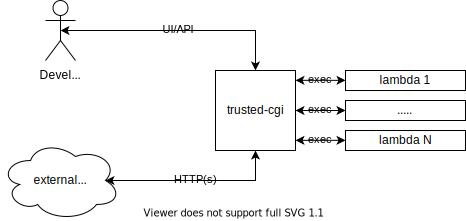

# Trusted-CGI

[](https://github.com/reddec/trusted-cgi)
[](http://godoc.org/github.com/reddec/trusted-cgi/application)
[](http://reddec.net/about/#donate)
[](https://bintray.com/reddec/debian/trusted-cgi/_latestVersion)

Lightweight self-hosted lambda/applications/cgi/serverless-functions engine. 



The process flow is quite straightforward: one light daemon in background listens for requests and launches scripts/apps
on demand. An executable shall read standard input (stdin) for request data and write a response to standard output (stdout).

Technically any script/application that can parse STDIN and write something to STDOUT should be capable of the execution.

Trusted-cgi designed keeping in mind that input and output data is quite small and contains structured data (json/xml),
however, there are no restrictions on the platform itself.

Key differences with classic CGI:

* Only request body is being piped to scripts input (CGI pipes everything, and application has to parse it by itself - it could be very not trivial and slow (it depends))
* Request headers, form fields, and query params are pre-parsed by the platform and can be passed as an environment variable (see mapping)
* Response headers are pre-defined in manifest

Due to changes, it's possible to make the simplest script with JSON input and output like this:

```python
import sys
import json

request = json.load(sys.stdin) # read and parse request
response = ['hello', 'world']  # do some logic and make response
json.dump(response, sys.stdout)  # send it to client
```  

Keep in mind, the platform also adds a growing number of new features - see features.

**target audience**

It's best (but not limited) for

* for hobby projects
* for experiments
* for projects with a low number of requests: webhooks, scheduled processing, etc..
* for a project working on low-end machines: raspberry pi, cheapest VPS, etc..

However, if your projects have overgrown the platform limitations, it should be quite easy to migrate to any other solutions, because
most low-level details are hidden and could be replaced in a few days (basically - just wrap script to HTTP service)  

Also, it is possible to scale the platform performance by just launching the same instances of the platform
with a shared file system (or docker images) with a balancer in front of it.


<iframe width="560" height="315" src="https://www.youtube.com/embed/GjqhQXlOdWQ" frameborder="0" allow="accelerometer; autoplay; encrypted-media; gyroscope; picture-in-picture" allowfullscreen></iframe>

**Idea behind**

The idea came from the past: CGI. At the beginning of the Internet, people have been making a simple script that receives incoming bytes over STDIN 
(standard input) and writes to STDOUT (standard output). The application server (aka CGI server), accepts clients,
invokes scripts and redirects socket input/output to the script. There are a lot of details here but this is a brief explanation.

After more than 20 years the world spin around and arrived at the beginning: serverless functions/lambda and so on.
It is almost CGI, except scripts became docker containers, and we need many more servers to do the same things as before.

So let's cut the corners a bit: we have a trusted developer (our self, company workers - means it's not arbitrary clients), 
so we don't need a heavy restriction for the application, so let's throw away docker and another heavy staff.

## Docs and features

* [Manifest](manifest.md) - main and mandatory entrypoint for the lambda
* [Actions](actions.md) - arbitrary actions that could be invoked by UI or by scheduler
* [Scheduler](scheduler.md) - cron-like scheduling system to automatically call actions by time
* [Aliases](aliases.md) - permanent links and aliases/links
* [Security](security.md) - security and restrictions
* [GIT repo](git_repo.md) - using GIT repo as a function

**High-level components diagram**


**URL**

Each function contains at least one URL: `<base URL>/a/<UID>` and any number of unique [aliases/links](aliases.md) `<base URL>/l/<LINK NAME>`.


## Why I did it?
 
Because I want to write small handlers that will be 99% of the time just do nothing. I am already paying for the cheapest
Digital Ocean (thanks guys for your existence) and do not want to pay additionally to Lambda providers like Google/Amazon/Azure.

I also tried self-hosted solutions based on k3s but it too heavy for 1GB server (yep, it is, don't believe in marketing).

So, 'cause I am a developer I decided to make my own wheels ;-)

# Installation

TL;DR;

* for production for debian servers - use bintray repository (recommend)
* locally or non-debian server - [download binary](https://github.com/reddec/trusted-cgi/releases) and run
* for quick tests or for limited production - use docker image (`docker run --rm -p 3434:3434 reddec/trusted-cgi`)

See [installation manual](installation.md)

# Contributing

The platform is quite simple Golang project with Vue + Quasar frontend 
and should be easy for newcomers. Caveats and tips for backend check [here](development.md)

For UI check [sub-repo](https://github.com/reddec/trusted-cgi-ui)

Any PR (docs, code, styles, features, ...) will be very helpful!